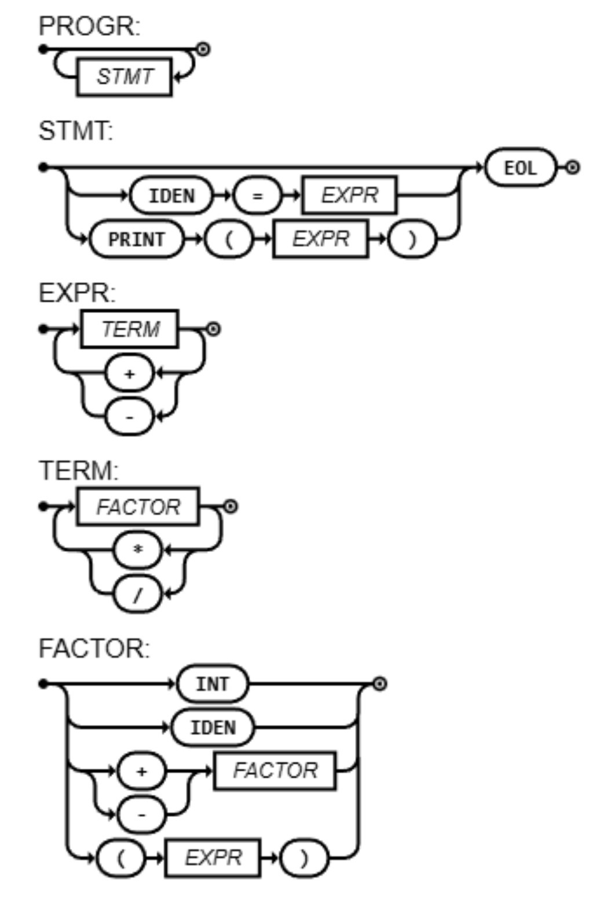

# LogComp

[](https://compiler-tester.insper-comp.com.br/svg/Takahacker/LogComp)

This repository is monitored by Compiler Tester for automatic compilation status.



```ebnf
PROGRAM = { STATEMENT } ;
STATEMENT = ((IDENTIFIER, "=", EXPRESSION) | (PRINT, "(", EXPRESSION, ")") | ε), EOL ;
EXPRESSION = TERM, { ("+" | "-"), TERM } ;
TERM = FACTOR, { ("*" | "/"), FACTOR } ;
FACTOR = ("+" | "-"), FACTOR | "(", EXPRESSION, ")" | NUMBER ;
NUMBER = DIGIT, {DIGIT} ;
DIGIT = 0 | 1 | ... | 9 ;
IDENTIFIER = LETTER, {LETTER | DIGIT | "_"} ;
LETTER = a | b | ... | z | A | B | ... | Z ;

```